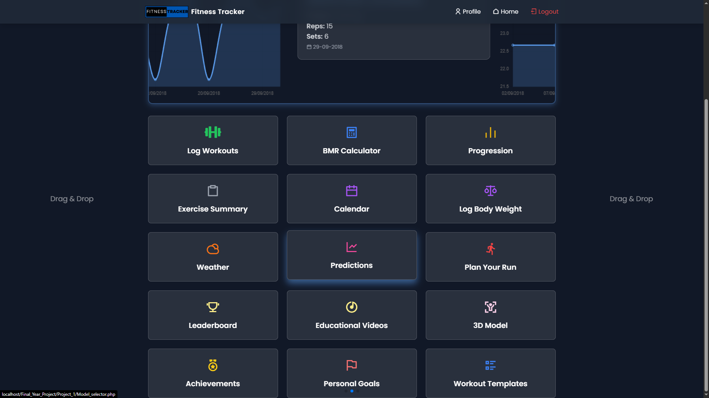
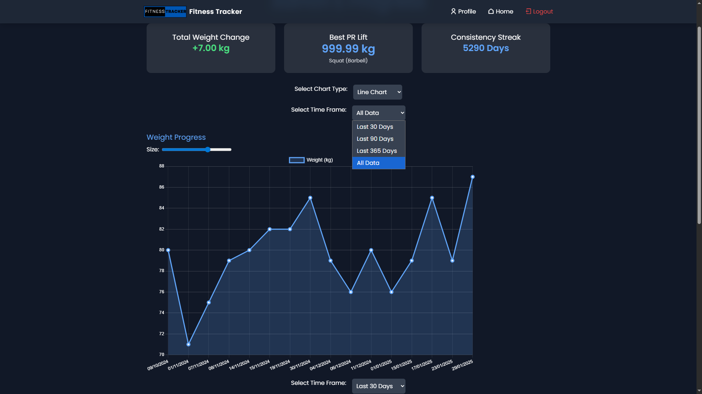
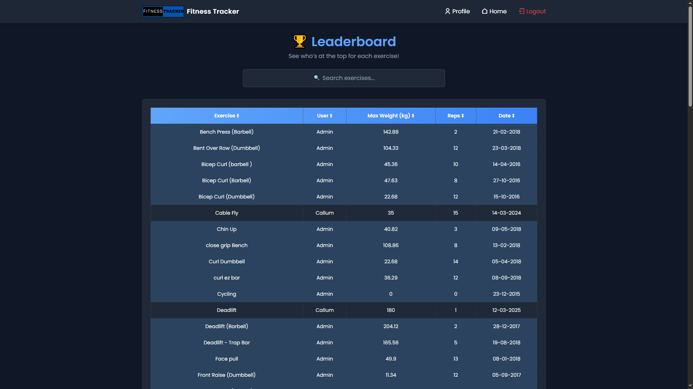
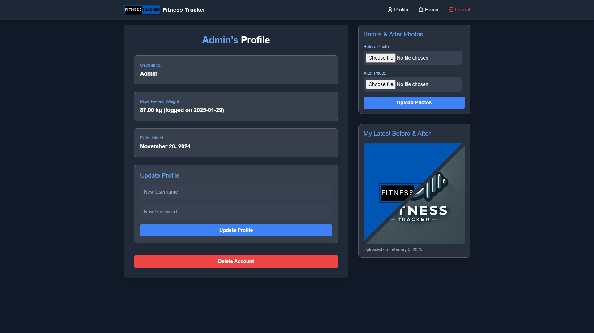

# GymGoer Fitness Tracker Web App

A full-stack web application built to help gym-goers log workouts, track progress, and receive AI-powered exercise predictions. Designed to be simple, responsive, and effective for users aiming to monitor their fitness journey.

## Features

- 🏋️ Log exercises (sets, reps, weight) and body weight
- 📊 Visualise progress with interactive charts
- 🧠 AI predictions using Support Vector Regression (SVR) with Phpml
- 🏆 Leaderboard for top lifts across users
- 🔐 Secure user registration and login system
- 🌐 Clean, responsive UI suitable for all devices

## 🛠️ Tech Stack

- **Frontend:** HTML, CSS/TailWind, JavaScript
- **Backend:** PHP (vanilla PHP)
- **Machine Learning:** Phpml library (SVR, Linear Regression)
- **Database:** MySQL via XAMPP
- **Package Manager:** Composer

## 📦 Installation

1. **Clone the repository:**
   ```bash
   git clone https://github.com/CallumC28/Gym-Goer-Web-App.git
   cd Gym-Goer-Web-App

2. ## Install Dependencies with Composer ##
   Make sure you have Composer installed on your system.
   ```bash
   composer install

3. ## Set Up the MySQL Database ##
   Launch XAMPP and start Apache and MySQL.
   
   Open phpMyAdmin and create a new database (e.g. tracker).
   
   Import the SQL schema file located in the /database/ directory.
   
   Update database credentials in config.php to match your XAMPP setup.
   
   4. Run the App
   Place the project folder inside your htdocs/ directory (XAMPP).
   
   In your browser, go to:
   http://localhost/Gym-Goer-Web-App **(Will be different for you)**

## 🖼️ Screenshots

### Dashboard
 

### BMR Calculator
.png)

### Weather API intergration
.png)

### AI-Powered Prediction
.png)

### AI-Powered Prediction - choose which model you prefer


### Progress Page


### LeaderBoard


### Profile Page

   
## 📚 Dependencies
 -  **php-ai/php-ml** – Machine learning library for PHP
 -  **Composer** – PHP dependency management
