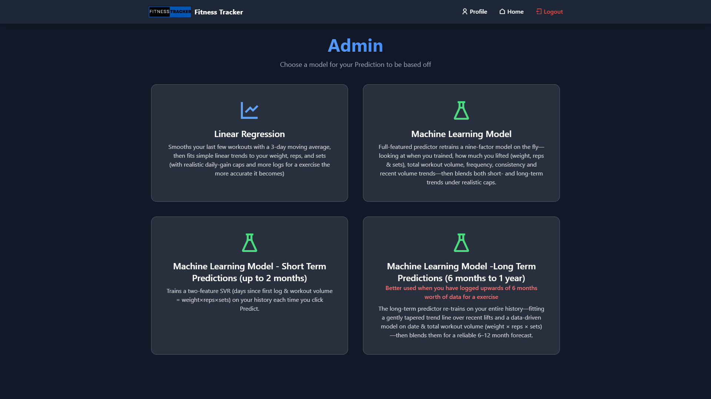

# GymGoer Fitness Tracker Web App

A full-stack web application built to help gym-goers log workouts, track progress, and receive AI-powered exercise predictions. Designed to be simple, responsive, and effective for users aiming to monitor their fitness journey.

## Key Features

- 🏋️ Log exercises (sets, reps, weight) and body weight
- 📊 Visualise progress with interactive charts
- 🧠 AI predictions using Support Vector Regression (SVR) with Phpml
- 🏆 Leaderboard for top lifts across users
- ☁️ Weather API intergration for planning outdoor activities
- 🔐 Secure user registration and login system
- 🌐 Clean, responsive UI suitable for all devices

## Tech Stack

- **Frontend:** HTML, CSS/TailWind, JavaScript
- **Backend:** PHP (vanilla PHP)
- **Machine Learning:** Phpml library (SVR, Linear Regression)
- **Database:** MySQL via XAMPP
- **Package Manager:** Composer

## How the AI Works

1. **Data Collection**: The app fetches the user's exercise logs from the database.
2. **Data Filtering**: Only the highest weight lifted per day is considered for prediction.
3. **Feature Engineering**: The data is processed to calculate user-specific progression rates, workout consistency, and volume adjustments.
4. **SVR Model Training**: A Support Vector Regression model is trained using the processed data to predict future workout performance.
5. **Prediction Calculation**: Multiple prediction models are blended (short-term, long-term, and SVR) to generate a final prediction for weight, reps, and sets.
6. **Physiological Constraints**: The model applies constraints to ensure predictions are realistic and based on the user's past performance.
7. **Prediction Output**: The system outputs predicted weight, reps, and sets along with confidence intervals and estimated time to achieve the target goals.
8. **Visualisation**: The results are displayed on dynamic charts, including confidence intervals, historical data, and predictions.
9. **Exporting Data**: Users can export their exercise data and prediction results as a CSV file.

## Example Prediction Output

The prediction output provides the following:

- **Predicted Weight**: The estimated weight the user will be able to lift in the specified time frame.
- **Confidence Interval**: The 99% confidence interval for the predicted weight.
- **Predicted Reps and Sets**: Estimated reps and sets for the predicted weight.
- **Daily Improvement Rate**: The average daily improvement rate based on historical data.
- **Consistency Factor**: The user's consistency in training, expressed as a percentage.
- **Volume Adjustment Factor**: Adjustments made to account for changes in training volume over time.


## Installation

1. **Clone the repository:**
   ```bash
   git clone https://github.com/CallumC28/Gym-Goer-Web-App.git
   cd Gym-Goer-Web-App

2. ## Install Dependencies with Composer ##
   Make sure you have Composer installed on your system.
   ```bash
   composer install

3. ## Set Up the MySQL Database ##
   Launch XAMPP and start Apache and MySQL.
   
   Open phpMyAdmin and create a new database (e.g. tracker).
   
   Import the SQL schema file located in the /database/ directory.
   
   Update database credentials in config.php to match your XAMPP setup.
   
   4. Run the App
   Place the project folder inside your htdocs/ directory (XAMPP).
   
   In your browser, go to:
   http://localhost/Gym-Goer-Web-App **(Will be different for you)**

## Screenshots

### Dashboard
 

### BMR Calculator
.png)

### Weather API intergration
.png)

### AI-Powered Prediction
.png)

### AI-Powered Prediction - choose which model you prefer


### Progress Page


### LeaderBoard


### Profile Page

   
## Dependencies
 -  **php-ai/php-ml** – Machine learning library for PHP
 -  **Composer** – PHP dependency management

## Future Improvements that could be made
 -  **Advanced Analytics:** Introduce weekly/monthly performance summaries or progress trends.
 -  **Smarter AI:** Train models on larger datasets or use more advanced algorithms (e.g. Random Forest, Neural Networks).
 -  **User Notes:** Allow users to add comments or notes to each workout (e.g. "Felt strong today" or "Tried new form").
 -  **Nutrition Tools:** Add a macro tracker to support dieting goals (e.g. Could be done with an API or hard coded dependant on if you want to pull food data from a data base like Fitness Pal does)

